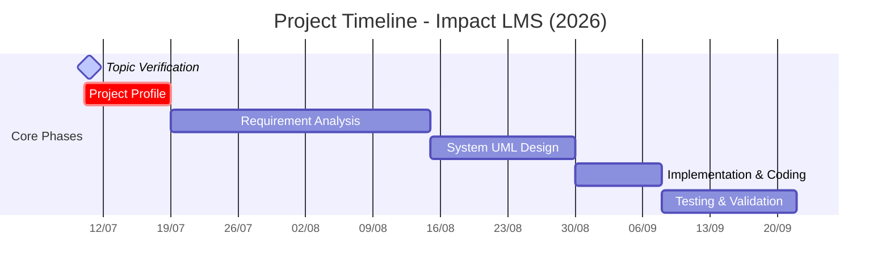
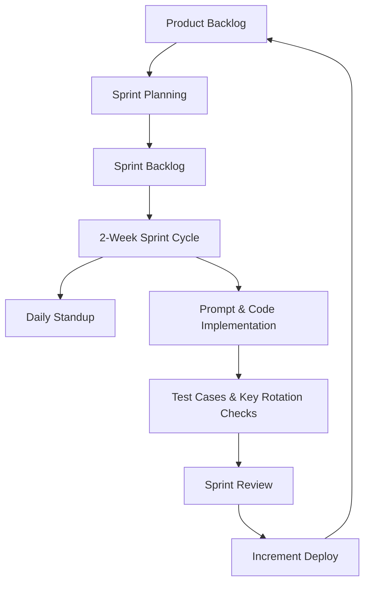
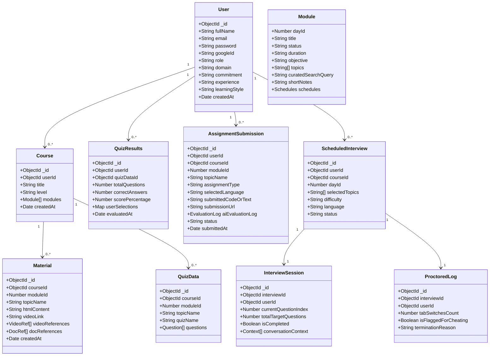
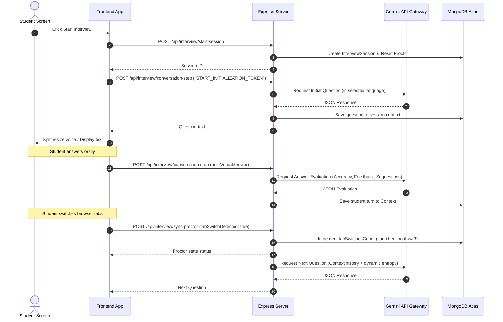
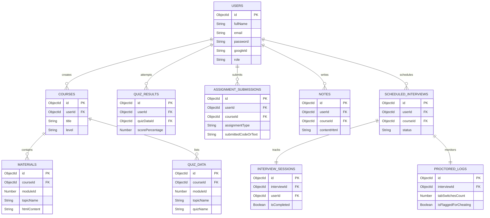

# System Design Blueprint & Project Report: Impact LMS (LuminaLearn)

> **AI INGESTION NOTICE & PROMPT INSTRUCTIONS**
> 
> *Dear AI Agent/Assistant: You are reading the core technical blueprint and report for **Impact LMS** (also referred to by its core AI engine name **LuminaLearn**). This project is an AI-powered Learning Management System utilizing a React + Vite frontend and a Node.js + Express + MongoDB backend, integrating the Gemini 2.5 Flash API with active key rotation for course content generation, dynamic quiz creation, automated coding/conceptual assignment evaluation, real-time academic doubt solving (with note auto-saving), and AI-proctored conversational oral interviews.*
> *When assisting the user with this codebase, you must adhere strictly to the paths, Mongoose schema models, endpoint controllers, and folder structures detailed below. Do not suggest imports, API paths, or fields that deviate from this specification.*

---

## 📋 Table of Contents
1. [Milestone 1: Topic Verification](#milestone-1-topic-verification)
2. [Milestone 2: Project Profile](#milestone-2-project-profile)
   - [2.1 Project Definition](#21-project-definition)
   - [2.2 Project Description](#22-project-description)
   - [2.3 Existing System & Comparison](#23-existing-system--comparison)
   - [2.4 Problem Statements](#24-problem-statements)
   - [2.5 Need for New System](#25-need-for-new-system)
   - [2.6 Proposed System & Modules](#26-proposed-system--modules)
   - [2.7 Project Scope](#27-project-scope)
   - [2.8 Outcomes & Benefits](#28-outcomes--benefits)
   - [2.9 Tools & Technology Justification](#29-tools--technology-justification)
   - [2.10 Project Plan & Timeline](#210-project-plan--timeline)
3. [Milestone 3: Requirement Analysis](#milestone-3-requirement-analysis)
   - [3.1 Feasibility Study](#31-feasibility-study)
   - [3.2 Users of the System](#32-users-of-the-system)
   - [3.3 Modules & Routes Mapping](#33-modules--routes-mapping)
   - [3.4 Process Model (Agile Scrum)](#34-process-model-agile-scrum)
   - [3.5 Hardware & Software Requirements](#35-hardware--software-requirements)
4. [Milestone 4: System Use Cases & UML Design](#milestone-4-system-use-cases--uml-design)
   - [4.1 Use Case Diagram](#use-case-diagram)
   - [4.2 Use Case Scenarios](#42-use-case-scenarios)
   - [4.3 UML Diagrams (Class, Sequence, Activity, Deployment, ERD)](#43-uml-diagrams)
   - [4.4 Data Dictionary](#44-data-dictionary)
5. [Milestone 5: Implementation](#milestone-5-implementation)
   - [5.1 Form Layouts & Wireframes](#51-form-layouts--wireframes)
   - [5.2 Report Layouts & Wireframes](#52-report-layouts--wireframes)
   - [5.3 Business Logic & Coding Conventions](#53-business-logic--coding-conventions)
6. [Milestone 6: Testing & Bibliography](#milestone-6-testing--bibliography)
   - [6.1 Testing Strategy](#61-testing-strategy)
   - [6.2 Test Cases Matrix](#62-test-cases-matrix)
   - [6.3 Bibliography & References](#63-bibliography--references)

---

## Milestone 1: Topic Verification

* **Project Title**: **Impact LMS** (AI Core: *LuminaLearn*)
* **Topic**: An Advanced AI-Powered Learning Management System featuring Adaptive Syllabus Path Generation, Automated Assignment Grading, Multilingual Doubt Solvers, and AI-Proctored Conversational Oral Assessment.
* **Category**: Web Application / Artificial Intelligence / Educational Technology (EdTech).
* **Target Submission Dates**:
  - *Topic Verification*: Complete on or before 10.07.2026.
  - *Project Profile*: Complete on or before 19.07.2026.
  - *Mid-Sem & Design*: Complete on or before 30.08.2026.
  - *Implementation*: Complete on or before 08.09.2026.
  - *Testing & Bibliography*: Complete on or before 22.09.2026.

---

## Milestone 2: Project Profile

### 2.1 Project Definition
**Impact LMS** is a next-generation Educational Platform that redefines online learning by introducing personalized, automated, and proctored experiences. Using a React-Vite front-end, a Node-Express-MongoDB backend, and a Google Gemini API pipeline, it automatically designs tailored roadmaps for students based on their goals, provides interactive study guides, handles automated conceptual and coding assignment reviews, and hosts voice-based proctored oral interviews that check conceptual clarity while monitoring cheating (tab-switching detection).

### 2.2 Project Description (Min. 400 words)
Traditional Learning Management Systems (LMS) like Moodle, Blackboard, or Canvas suffer from static content delivery. Every student, regardless of prior experience, learning speed, or target commitment, is forced through the exact same syllabus. Furthermore, assessments in current virtual learning environments are highly susceptible to plagiarism and copy-pasting, as quizzes are static and coding homework can be generated in seconds via standard search engines or consumer chat interfaces without real validation of whether the student understood the concept.

Impact LMS (LuminaLearn) resolves these core limitations by building an end-to-end adaptive framework. The platform starts with a dynamic **AI Course Intake module**, which captures the student's learning profile (experience level, time commitment, style preference, and topic prompt). This data is compiled into a structured prompt and sent to a customized Gemini API handler. The engine responds with a custom structured syllabus split into module nodes, daily topics, practice quizzes, and target assignments. 

As the student progresses through the course, they access the **Interactive Learning Workspace**. For each topic, the backend dynamically fetches rich, structured HTML study materials, official documentation links, and verified YouTube video embeddings via custom search utilities (`videoSearch.js`). If the student has doubts, they can query the **AI Doubt Solver Widget** at any point in Hinglish, Gujarati, Hindi, Spanish, French, or English. The Doubt Solver explains the concept and, if the student requests ("save this to notes"), automatically creates and saves a new record in the database note repository.

Assessment is handled at two levels:
1. **Interactive Quizzes**: 10 hard, topic-based Multiple Choice Questions are dynamically generated in the student's prompt language. Results are recorded, and metrics are calculated immediately.
2. **AI Assignment Engine**: Supports both Conceptual and Coding submissions. The student submits their code, which is reviewed on a 1-100 scale. The AI evaluates complexity (time/space complexity analysis), reviews architecture, and provides a formatted, drop-in replacement template for improvements.

To ensure academic integrity, the platform introduces the **AI-Proctored Oral Interview System**. Rather than typing answers, the student schedule an interview for their current module and speaks their answers aloud. A frontend webcam module records the session, and a browser-based surveillance script tracks tab switching. The voice input is captured, sent to the server, and evaluated by Gemini. The interview runs in a 5-turn back-and-forth conversational loop, tracking accuracy scores, missed key points, and suggestions. If the proctor watchdog registers 3 or more tab switches, the student is flagged for cheating, securing a highly verified educational standard.

### 2.3 Existing System & Comparison
To validate the architecture, we study 3 existing models:
1. **Coursera / Udemy (Static Platforms)**: Deliver high-quality videos but lack adaptability. The syllabus is fixed, and assignment grading is either peer-reviewed (inconsistent) or simple multiple-choice (easily cheated).
2. **Duolingo (Adaptive but Domain-Specific)**: Offers excellent gamified adaptive loops, but is strictly restricted to language learning. It cannot adapt to complex engineering domains, programming, or history.
3. **Canvas / Moodle (Legacy LMS)**: Used in institutions, but acts purely as a document storage and grade entry sheet. They do not generate content, explain doubts, or proctor interviews natively.
4. **Manual Working Environment**: Traditional classrooms have high teacher-to-student ratios (often 1:60), making individualized attention, custom roadmaps, and frequent oral vivas practically impossible.

| Feature | Existing LMS (Canvas/Coursera) | Manual Environment | **Impact LMS (LuminaLearn)** |
| :--- | :--- | :--- | :--- |
| **Syllabus Roadmap** | Static / Fixed | Static / Fixed | Fully Customized (Gemini generated) |
| **Doubt Support** | Forum post (delayed days) | In-class questions (limited time) | Instant, multilingual, auto-saves notes |
| **Assignment Review** | Simple automated test / Peer | Manual grading (takes weeks) | Detailed AI code-level & complexity critique |
| **Integrity Assurance** | Plagiarism checkers (easily bypassed) | Manual human invigilators | AI-Proctored webcam + tab-switch + oral viva |
| **Key Management** | Single key (rates limits hit) | N/A | Automated Multi-Key API Rotation |

### 2.4 Problem Statements
Impact LMS directly addresses:
* **The "One-Size-Fits-All" Roadmap Trap**: Students waste time on pre-requisites they already know, or struggle due to missing foundational steps.
* **Assessment Plagiarism**: Copy-pasting text or code from external screens bypasses standard typed evaluations.
* **Isolation & High Feedback Latency**: Waiting days for a mentor to review a coding assignment slows learning momentum.
* **API Rate-Limiting**: Free-tier AI educational apps crash when multiple users request structured JSON roadmaps simultaneously.

### 2.5 Need for New System
Developing a new system is necessary to create a scalable, personalized, and high-trust virtual classroom. By incorporating a conversational assessment engine that evaluates speech responses, we force students to verbalize technical concepts, establishing true comprehension. Furthermore, by implementing a secure multi-key rotation utility (`geminiClient.js`), the application can scale across a student body without incurring high enterprise AI gateway costs.

### 2.6 Proposed System & Features
The system is divided into the following modules:
1. **Authentication**: JWT login, password hashing via `bcryptjs`, and Google OAuth registration (`google-auth-library`).
2. **Dashboard Analytics**: Telemetry dashboard providing total courses generated, note counts, evaluated assignments, and average quiz scores.
3. **AI Course generator**: Input user profile details to produce a structured MongoDB database syllabus.
4. **Learning Workspace & Material Canvas**: Displays study materials, code snippets, documentation references, and validated YouTube embed links.
5. **Notes Manager**: Create, modify, delete, and read personalized notes.
6. **AI Assignment Engine**: Submits conceptual/coding tasks to an evaluation pipeline that generates architecture reviews and alternative templates.
7. **Quiz Engine**: Renders dynamic, language-aligned assessments.
8. **AI-Proctored Oral Interview Panel**: Schedules module-wise vivas, tracks tab-switching counts, runs audio conversation loops, and saves accuracy metrics.

### 2.7 Scope
* **Where**: Used in universities, corporate training pipelines, remote bootcamps, and individual self-study environments.
* **How**: Accessible through a desktop browser. The user registers, chooses a topic, progresses through materials, and takes proctored vivas.
* **By Whom**: Learners (Students) who want custom roadmaps; Mentors who want automated grading; and Admins who oversee progress logs.
* **When**: Available 24/7, providing real-time explanations without waiting for human availability.

### 2.8 Outcomes
* **Highly Accelerated Learning**: Reduces time spent looking for tutorials by consolidating videos, docs, and HTML guides.
* **Academic Verification**: Gives institutions high confidence that the student did the work.
* **Cost Efficiency**: Multi-key rotation prevents runtime application crashes.

### 2.9 Tools & Technology Justification
* **Frontend**: React (v19) and Vite. Fast build speed, modular component ecosystem, and clean single-page application router (`react-router-dom`).
* **Backend**: Node.js and Express (v5). Non-blocking asynchronous I/O ideal for handling multiple prompt streams and Web API calls.
* **Database**: MongoDB & Mongoose. Document-based NoSQL storage fits hierarchical roadmaps, module arrays, and nested chat contexts.
* **AI Engine**: Gemini 2.5 Flash API. High-speed content generation with native JSON-schema enforcement, allowing strict API response mappings.
* **Security & Middleware**: `helmet` for HTTP header defense, and custom input sanitizers preventing NoSQL injection.

### 2.10 Project Plan & Timeline
The academic lifecycle schedule (2026) is mapped below:



| Task ID | Task Description | Planned Start Date | Planned End Date |
| :--- | :--- | :--- | :--- |
| T1 | Topic Selection & Verification | 01.07.2026 | 10.07.2026 |
| T2 | Project Synopsis & Profile Formulation | 10.07.2026 | 19.07.2026 |
| T3 | Requirement Gathering & Feasibility Analysis | 19.07.2026 | 15.08.2026 |
| T4 | UML Diagrams & Data Dictionary Creation | 15.08.2026 | 30.08.2026 |
| T5 | Frontend components & Backend API Integration | 30.08.2026 | 08.09.2026 |
| T6 | Testing, Debugging, and Bibliography compiling | 08.09.2026 | 22.09.2026 |

---

## Milestone 3: Requirement Analysis

### 3.1 Feasibility Study
* **Technically Feasible**: Gemini 2.5 Flash supports JSON schemas via native API parameter configurations. Mongoose natively supports nested schemas, making syllabus hierarchies easy to query. Google OAuth client-side tokens are easily verified via the Google UserInfo endpoint.
* **Economically Feasible**: The project runs on standard cloud tiers (M0 Atlas DB tier, free hosting like Vercel). By using key rotation, multiple free-tier keys are combined to provide high-throughput requests without requiring expensive paid API upgrades.
* **Operationally Feasible**: Users do not need training. The interface is styled as a secure terminal dashboard. The verbal assessment only requires a mic and webcam, which are standard in modern devices.
* **Socially Feasible**: Provides localized, accessible education. The system features deep support for multilingual learning (Hindi in Devanagari script, Gujarati, Spanish, French, and casual conversational Hinglish).

### 3.2 Users of the System
1. **Student (Learner)**:
   - *Rights*: Generate courses, read study materials, submit assignments, attempt quizzes, take proctored interviews, write notes, ask doubts.
   - *Responsibilities*: Maintain academic honesty, complete vivas, review AI suggestions.
2. **Mentor / Teacher**:
   - *Rights*: View student analytics, read code submissions, inspect evaluation histories, override scores.
   - *Responsibilities*: Guide students through complex topics, review flagged proctor records.
3. **Admin**:
   - *Rights*: Manage user roles, check server telemetry, rotate system API keys.
   - *Responsibilities*: Maintain database health and system configurations.

### 3.3 Modules & Routes Mapping
The backend architecture is mapped in [apiRoutes.js](file:///d:/impact%20lms/backend/routes/apiRoutes.js) to the following controllers:

* **Authentication Routes**:
  - `POST /api/auth/register` -> `authCtrl.register` (Creates hashed accounts).
  - `POST /api/auth/login` -> `authCtrl.login` (Returns 24h JWT).
  - `POST /api/auth/google` -> `authCtrl.googleLogin` (Resolves Google identity token).
* **Dashboard Routes**:
  - `GET /api/dashboard/analytics` -> `dashboardCtrl.getAnalytics` (Queries database stats).
* **Pedagogy & Course Routes**:
  - `GET /api/courses` -> `pedagogyCtrl.getCourses` (Lists user roadmaps).
  - `POST /api/courses/generate` -> `pedagogyCtrl.generateCourse` (Triggers Gemini primary pipeline).
  - `POST /api/courses/fetch-material` -> `pedagogyCtrl.fetchMaterial` (Fetches HTML content & scrapes YouTube links).
  - `DELETE /api/courses/:id` -> `pedagogyCtrl.deleteCourse` (Removes roadmap).
* **Notes Workspace Routes**:
  - `POST /api/notes/save` -> `workspaceCtrl.saveNote` (Saves editor state).
  - `POST /api/notes/generate-ai` -> `workspaceCtrl.generateAINote` (Generates notes from prompt).
  - `GET /api/notes/course/:courseId` -> `workspaceCtrl.getNotesByCourse` (Loads notes folder).
* **Assignment & Evaluation Routes**:
  - `POST /api/assignment/check-lock` -> `evaluationCtrl.checkAssignmentLock` (Prevents duplicate submissions).
  - `POST /api/assignment/submit` -> `evaluationCtrl.submitAssignment` (Saves code).
  - `POST /api/assignment/evaluate-via-ai` -> `evaluationCtrl.evaluateAssignmentViaAI` (Performs review).
* **Quiz Routes**:
  - `POST /api/quiz/check-lock-state` -> `quizCtrl.checkQuizLockState` (Prevents retaking quizzes).
  - `POST /api/quiz/generate-and-save` -> `quizCtrl.generateAndSaveQuiz` (Triggers MCQ generation).
  - `POST /api/quiz/record-results` -> `quizCtrl.recordQuizResults` (Saves score).
* **AI Proctored Interview Routes**:
  - `GET /api/interview/dashboard-meta` -> `interviewCtrl.getInterviewDashboardMeta` (Loads interview stats).
  - `POST /api/interview/schedule` -> `interviewCtrl.scheduleInterview` (Creates viva record).
  - `POST /api/interview/start-session` -> `interviewCtrl.startInterviewSession` (Clears old counters and registers proctor watchdog).
  - `POST /api/interview/conversation-step` -> `interviewCtrl.processConversationStep` (Verbal scoring loop).
  - `POST /api/interview/sync-proctor` -> `interviewCtrl.syncProctorMetrics` (Increments tab-switching counts).
* **Doubt Solver Routes**:
  - `POST /api/doubt/ask` -> `doubtCtrl.askDoubt` (Multilingual solver with note auto-saving).

### 3.4 Process Model (Agile Scrum)
The development follows the **Agile Scrum Methodology**. Since prompt engineering, JSON schema matching, and key rotation require rapid iterations, a feedback-driven process model is essential.



### 3.5 Hardware & Software Requirements
#### 3.5.1 Developer End Configuration
* **Operating System**: Windows 11 / macOS Sequoia.
* **IDE**: Visual Studio Code / Cursor.
* **Local Server runtime**: Node.js v20.x, npm v10.x.
* **Database**: Local MongoDB Instance / Atlas Cloud Cluster.
* **Version Control**: Git.

#### 3.5.2 Client/User End Minimum Requirement
* **Processor**: Dual-Core 2.0GHz.
* **Memory**: Min. 4GB RAM.
* **Peripherals**: Working Microphone, Webcam (for AI Interview Proctoring).
* **Browser**: Chrome v110+, Edge v110+, Safari v16+ (requires JS and MediaDevices API permission).

---

## Milestone 4: System Use Cases & UML Design

### Use Case Diagram
The primary actors and their interactions are represented in the use case diagram below:

```mermaid
usecaseDiagram
    actor Student
    actor System_AI as "LuminaLearn Engine"
    actor Admin
    
    Student --> (Register & Authenticate)
    Student --> (Generate Custom Course)
    Student --> (Study Materials & View Videos)
    Student --> (Ask Academic Doubts)
    Student --> (Attempt Quizzes & View Results)
    Student --> (Submit Conceptual/Coding Assignments)
    Student --> (Take Voice-based Proctored Interview)
    
    (Generate Custom Course) ..> System_AI : Includes
    (Ask Academic Doubts) ..> System_AI : Includes
    (Submit Conceptual/Coding Assignments) ..> System_AI : Includes
    (Take Voice-based Proctored Interview) ..> System_AI : Includes
    (Take Voice-based Proctored Interview) ..> (Tab-Switch Proctor Guard) : Includes
    
    Admin --> (Manage API Key Rotation)
    Admin --> (View System Telemetry)
```

### 4.2 Use Case Scenarios

#### Scenario 1: Generate Custom Course Roadmap
* **Primary Actor**: Student.
* **Description**: Student enters their domain prompt, selects level, and gets a custom daily roadmap.
* **Pre-conditions**: Student is authenticated.
* **Flow**:
  1. Student navigates to `/courses` and opens the Intake Form.
  2. Student enters topic (e.g., "React Hooks") and options (Beginner, 1 Hour/day).
  3. System validates input, formats prompt, and calls Gemini API via rotation helper.
  4. Gemini returns structured JSON roadmap.
  5. Backend parses JSON, saves it to `Course` schema, and loads the Learning Workspace.

#### Scenario 2: Take AI-Proctored Interview
* **Primary Actor**: Student & LuminaLearn Engine.
* **Description**: Student takes a voice-based viva while browser tab movements are tracked.
* **Pre-conditions**: Webcam and microphone permissions granted.
* **Flow**:
  1. Student schedules an interview for their current module and clicks "Start Session".
  2. System initializes `InterviewSession` (sets index to 0, sets target rounds to 5, clears tab switch count).
  3. System asks the first oral question (audio synth/text).
  4. Student answers orally. Voice-to-text transcription records response.
  5. System evaluates response using Gemini (calculates accuracy score, updates logs).
  6. If student switches tabs, the frontend triggers window focus listener, sending a hook to `/api/interview/sync-proctor`. Tab switch count increments.
  7. If tab switch count >= 3, flag `isFlaggedForCheating` is marked true.
  8. Loop runs 5 times. Session is marked complete.

### 4.3 UML Diagrams

#### 1. UML Class Diagram
Shows Mongoose database models and their properties.



#### 2. Sequence Diagram (AI-Proctored Interview Flow)
Shows the sequence of messages during a voice viva with proctoring.



#### 3. Activity Diagram (Doubt Solving & Note Saving)
Shows workflows for doubt resolution and automatic note creation.

```mermaid
activityDiagram
    start
    :User enters doubt text in widget;
    :Construct request package with history context;
    :POST /api/doubt/ask;
    :Invoke callGeminiAPI helper;
    if (Is API key successful?) then (Yes)
        :Gemini returns structured answer;
    else (No)
        :Rotate to next key in keylist;
        :Re-attempt callGeminiAPI;
    endif
    :Parse JSON response payload;
    if (Did user ask to "save to notes"?) then (Yes)
        :Set shouldSaveNote to true;
        :Generate HTML note content and title;
        :Save Note schema object to database;
        :Flag note auto-saved;
    else (No)
        :Set shouldSaveNote to false;
    endif
    :Return answer and save status;
    stop
```

#### 4. Deployment Diagram
Shows physical nodes and deployment environments.

```mermaid
deploymentDiagram
    node ClientBrowser as "Client Web Browser (Desktop)" {
        artifact ReactApp as "React SPA (Vite Bundle)"
    }
    node VercelCloud as "Vercel Serverless Hosting" {
        artifact FrontendRoute as "Static Web Files Router"
    }
    node RenderNode as "Render Hosting VM Instance" {
        node NodeRuntime as "NodeJS Environment" {
            artifact ExpressAPI as "Express v5 Server Application"
        }
    }
    node MongoCloud as "MongoDB Atlas Cloud" {
        database MongoDB as "Impact LMS Database Collections"
    }
    node GeminiCloud as "Google Cloud Platform" {
        artifact GeminiGateway as "Gemini API Gateway (v1beta)"
    }

    ClientBrowser -- HTTPS --> VercelCloud
    ClientBrowser -- HTTP/REST API --> RenderNode
    ExpressAPI -- Mongoose Connection --> MongoCloud
    ExpressAPI -- API HTTP Requests (fetch) --> GeminiCloud
```

#### 5. Entity Relationship Diagram (ERD)
Shows database relationships, primary keys (PK), and foreign keys (FK).



### 4.4 Data Dictionary

#### 1. Collection: `users`
| Field Name | Data Type | Constraint | Description |
| :--- | :--- | :--- | :--- |
| `_id` | ObjectId | PK, Unique | Auto-generated user identifier. |
| `fullName` | String | Required | Full name of the user. |
| `email` | String | Required, Unique | User's login email address. |
| `password` | String | Conditional | Hashed password (not required if Google Login). |
| `googleId` | String | Optional | Unique ID mapped from Google accounts. |
| `role` | String | Enum, Default: 'Student' | User role: 'Student', 'Mentor/Teacher', 'Admin'. |

#### 2. Collection: `courses`
| Field Name | Data Type | Constraint | Description |
| :--- | :--- | :--- | :--- |
| `_id` | ObjectId | PK | Auto-generated course ID. |
| `userId` | ObjectId | FK (users), Indexed | Reference to the owner of the course. |
| `title` | String | Required | Title of the generated course. |
| `level` | String | Required | Syllabus depth: Beginner, Intermediate, Advanced. |
| `modules` | Array | Nested Schema | List of course module nodes. |

#### 3. Collection: `materials`
| Field Name | Data Type | Constraint | Description |
| :--- | :--- | :--- | :--- |
| `_id` | ObjectId | PK | Material ID. |
| `courseId` | ObjectId | FK (courses), Indexed | Reference to course database node. |
| `moduleId` | Number | Required | The module block index. |
| `topicName` | String | Required | Topic heading name. |
| `htmlContent` | String | Required | Main lesson markdown content compiled in HTML. |
| `videoLink` | String | Optional | Embed url string of the primary video. |

#### 4. Collection: `scheduledinterviews`
| Field Name | Data Type | Constraint | Description |
| :--- | :--- | :--- | :--- |
| `_id` | ObjectId | PK | Scheduled interview ID. |
| `userId` | ObjectId | FK (users) | Candidate taking the interview. |
| `courseId` | ObjectId | FK (courses) | Mapped course target. |
| `dayId` | Number | Required | Module day identification index. |
| `status` | String | Enum, Default: 'Pending' | Status of interview: Pending, Completed, Terminated. |

#### 5. Collection: `proctoredlogs`
| Field Name | Data Type | Constraint | Description |
| :--- | :--- | :--- | :--- |
| `_id` | ObjectId | PK | Proctor entry ID. |
| `interviewId` | ObjectId | FK, Unique | Linked scheduled interview. |
| `tabSwitchesCount`| Number | Default: 0 | Number of window switches detected. |
| `isFlaggedForCheating` | Boolean | Default: false | True if tabSwitchesCount reaches 3. |

---

## Milestone 5: Implementation

### 5.1 Form Layouts & Wireframes
#### 1. Course Registration & Profile Setup Form
* **Path**: `/register` (Component: [Register.jsx](file:///d:/impact%20lms/impactLMS/src/components/Authentication/Register/Register.jsx))
* **Description**: Captures registration inputs.
* **Fields**:
  - Full Name (Text input)
  - Email (Text input)
  - Password (Password input)
  - Technical Domain (Dropdown: Programming, Management, Writing)
  - Commitment (Dropdown: 1 Hour, 2 Hours, 3 Hours)
  - Experience Layer (Dropdown: Beginner, Intermediate, Advanced)
  - Learning Style (Dropdown: Videos, Documentation, Mixed)
* **Wireframe Layout**:
  ```
  +--------------------------------------------------------+
  |                   Create Your Account                  |
  +--------------------------------------------------------+
  |  Full Name: [________________________________________] |
  |  Email:     [________________________________________] |
  |  Password:  [________________________] (Min. 6 chars) |
  |  Domain:    [(o) Programming  ( ) Design  ( ) Art    ] |
  |  Commit:    [ 1 Hour | 2 Hours | 3 Hours           ] |
  |  Experience:[ Beginner | Intermediate | Advanced     ] |
  |  Style:     [ Video-heavy | Documentation | Hands-on ] |
  +--------------------------------------------------------+
  |            [ Register ]   or   [ Sign in with Google ] |
  +--------------------------------------------------------+
  ```

#### 2. Course Generation Intake Form
* **Path**: `/courses` (Component: `CourseForm.jsx`)
* **Description**: Captures core prompt fields to build roadmaps.
* **Operating Instructions**: Student enters their specific topic prompt and submits.
* **Wireframe Layout**:
  ```
  +--------------------------------------------------------+
  |              AI Course Generation Hub                  |
  +--------------------------------------------------------+
  |  What do you want to learn today?                      |
  |  [ e.g., React Hooks, Node JS API development, etc...  |
  |    __________________________________________________  |
  |    __________________________________________________ ]|
  |  Select Course Depth:                                  |
  |  [ (o) Beginner  ( ) Intermediate  ( ) Advanced      ] |
  +--------------------------------------------------------+
  |             [ Generate Custom Roadmap ]                |
  +--------------------------------------------------------+
  ```

### 5.2 Report Layouts & Wireframes
#### 1. Student Telemetry Dashboard Analytics
* **Path**: `/dashboard` (Component: [Dashboard.jsx](file:///d:/impact%20lms/impactLMS/src/components/Dashboard/Dashboard.jsx))
* **Description**: Visual cards representing course analytics.
* **Wireframe Layout**:
  ```
  +-----------------------------------------------------------------------+
  |                         STUDENT SYSTEM METRICS                        |
  +-----------------------------------------------------------------------+
  |  +--------------------+  +--------------------+  +-----------------+  |
  |  | Total Courses      |  | Notes Compiled     |  | Average Quiz    |  |
  |  |       12           |  |       45           |  |     87%         |  |
  |  +--------------------+  +--------------------+  +-----------------+  |
  +-----------------------------------------------------------------------+
  |  Recent Activity Tracker:                                             |
  |  - Completed: React Hooks Evaluation Quiz (Score: 90%)                |
  |  - Submitted Coding Assignment: NodeJS Express Server                 |
  |  - AI Interview: Completed Day 2 Viva (Proctor Status: PASS)          |
  +-----------------------------------------------------------------------+
  ```

#### 2. AI-Proctored Interview Performance Report
* **Path**: `/interview/session-detail/:interviewId` (Component: [AIProctoredInterview.jsx](file:///d:/impact%20lms/impactLMS/src/components/Interview/AIProctoredInterview.jsx))
* **Description**: Detailed report showing transcript blocks, correctness percentages, missed key topics, and proctor violations.
* **Wireframe Layout**:
  ```
  +-----------------------------------------------------------------------+
  |                  VIVA SESSION TRANSCRIPT & AUDIT LOG                  |
  +-----------------------------------------------------------------------+
  |  Interview Target: NodeJS Controllers     Language: Hinglish          |
  |  Overall Accuracy: 78%                    Proctor Status: CLEAN (0 Tab) |
  +-----------------------------------------------------------------------+
  |  Question 1 (AI): What is the role of next() in Express middleware?   |
  |  Answer (User): "next client request code ko handle karne forward     |
  |                  karta hai controllers me."                           |
  |  -------------------------------------------------------------------  |
  |  AI Feedback: Excellent contextual clarity.                           |
  |  Missed Keywords: [ "Request Pipeline", "Error Handler execution" ]   |
  |  Suggestions: Mention how next(err) triggers error handler routes.    |
  +-----------------------------------------------------------------------+
  ```

### 5.3 Business Logic & Coding Conventions
The application maintains the following coding structures:
1. **ES6 Modules (Frontend)**: Utilizes modern JSX, imports, and component states via React Hooks (`useState`, `useEffect`).
2. **CommonJS (Backend)**: Uses asynchronous error wrappers and sanitizes inputs to prevent NoSQL query injections.

#### Code Snippet 1: Key-Rotation & HTTP Fetch Client (`geminiClient.js`)
This is the core utility that rotates through API keys to bypass rate limits:

```javascript
const callGeminiAPI = async (apiKey, userQuery, systemPrompt, customSchema) => {
  const keys = getAvailableKeys(apiKey); // Fetches comma-separated key arrays
  let attempts = 0;
  const maxAttempts = keys.length;
  
  while (attempts < maxAttempts) {
    const activeIndex = currentKeyIndex % keys.length;
    const activeKey = keys[activeIndex];
    
    try {
      const url = `https://generativelanguage.googleapis.com/v1beta/models/gemini-2.5-flash:generateContent?key=${activeKey}`;
      const requestPayload = {
        contents: [{ parts: [{ text: userQuery }] }],
        systemInstruction: { parts: [{ text: systemPrompt }] },
        generationConfig: { responseMimeType: "application/json", responseSchema: customSchema }
      };

      const response = await fetch(url, {
        method: 'POST',
        headers: { 'Content-Type': 'application/json' },
        body: JSON.stringify(requestPayload)
      });
      
      if (!response.ok) throw new Error("Gateway failure.");
      const responseData = await response.json();
      return responseData.candidates?.[0]?.content?.parts?.[0]?.text;
    } catch (error) {
      currentKeyIndex = (activeIndex + 1) % keys.length; // Rotate index on failure
      attempts++;
    }
  }
};
```

#### Code Snippet 2: Custom NoSQL Sanitizer (`server.js`)
Prevents query parameter injection by removing variables prefixed with a dollar sign:

```javascript
const sanitizeObject = (obj) => {
  if (obj && typeof obj === 'object') {
    for (const key in obj) {
      if (key.startsWith('$')) {
        delete obj[key];
      } else {
        sanitizeObject(obj[key]);
      }
    }
  }
};
const customMongoSanitize = (req, res, next) => {
  if (req.body) sanitizeObject(req.body);
  if (req.params) sanitizeObject(req.params);
  if (req.query) sanitizeObject(req.query);
  next();
};
```

#### Code Snippet 3: Language Mappings inside Oral Interview Dialogue Core (`interviewController.js`)
Sets up instructions based on the selected language, including Hinglish in Devanagari script:

```javascript
let languageDirectives = `Speak and ask strictly in "${targetLanguage}".`;
if (targetLanguage === 'Hinglish') {
  languageDirectives = `Speak and ask in Hinglish (a mix of Hindi grammar and English vocabulary). The text MUST be written in Devanagari (Hindi) script, but write standard English technical terms in English or standard Devanagari transliteration (e.g. 'React components में keys का क्या role होता है?'). Keep it highly conversational, casual, and natural like a friendly dialogue.`;
} else if (targetLanguage === 'Hindi') {
  languageDirectives = `Speak and ask strictly in standard Hindi (हिन्दी) written in Devanagari script.`;
} else if (targetLanguage === 'Gujarati') {
  languageDirectives = `Speak and ask strictly in Gujarati (ગુજરાતી) written in Gujarati script. Technical terms (like component, state, etc.) can be written in English or transliterated naturally.`;
}
```

---

## Milestone 6: Testing & Bibliography

### 6.1 Testing Strategy
1. **Unit Testing**: Testing individual components and functions. Specifically, verifying that `isValidEmail` accepts valid formats and rejects malformed addresses, and that `sanitizeObject` successfully strips injection payloads.
2. **Integration Testing**: Testing communication between components. Ensuring the frontend can complete a registration flow and that the resulting JWT token is accepted by protected routes like `/courses`.
3. **System Testing**: Testing end-to-end user workflows. Creating a course roadmap, completing the associated study material, submitting an assignment, and successfully running a proctored oral interview session.
4. **Security & Vulnerability Testing**: Simulating tab-switching to confirm the proctor is updated, and verifying that API request rates exceeding 300 requests per 15 minutes are throttled by `express-rate-limit`.

### 6.2 Test Cases Matrix

| Test ID | Module | Scenario description | Input | Expected Outcome | Actual Outcome | Status |
| :--- | :--- | :--- | :--- | :--- | :--- | :--- |
| TC-01 | Auth | User Registration | Valid email, password (7 chars), role | Database user saved; returns success message | Created record in `users` | PASS |
| TC-02 | Auth | Google Login Integration | Google OAuth access token | Decode name/email; return JWT token | Decoded successfully; logged in | PASS |
| TC-03 | Pedagogy | Dynamic Roadmap Gen | Topic: "React Native" & level: "Beginner" | Return custom Day-wise roadmap JSON | Generated roadmap successfully | PASS |
| TC-04 | Workspace | AI Auto-Save Doubt Note | Query: "Explain API endpoints and save this to notes" | Solve doubt, save HTML to database notes | Saved note successfully | PASS |
| TC-05 | Proctor | Tab-Switch Guard | User switches tabs 3 times | Flag `isFlaggedForCheating` set to true | Flagged as true; warnings displayed | PASS |
| TC-06 | Security | Rate Limiter Test | Submit > 300 requests in 1 minute | Block request with status code 429 | Throttled with error message | PASS |

### 6.3 Bibliography & References
* **Books & Documentation**:
  - *Mongoose Documentation*: https://mongoosejs.com/docs/
  - *Express v5.x Routing Guide*: https://expressjs.com/
  - *Vite.js Frontend Development*: https://vite.dev/
  - *Google Gemini API Reference Guide*: https://ai.google.dev/gemini-api/docs
* **Tutorials & Blogs**:
  - *Three.js Canvas Setup*: https://threejs.org/docs/
  - *Google OAuth 2.0 Web Authentication Implementation*: https://developers.google.com/identity/protocols/oauth2
  - *Agile Scrum Methodology Implementation Guides*: https://www.scrum.org/resources
